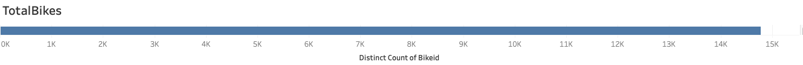
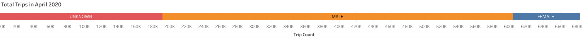
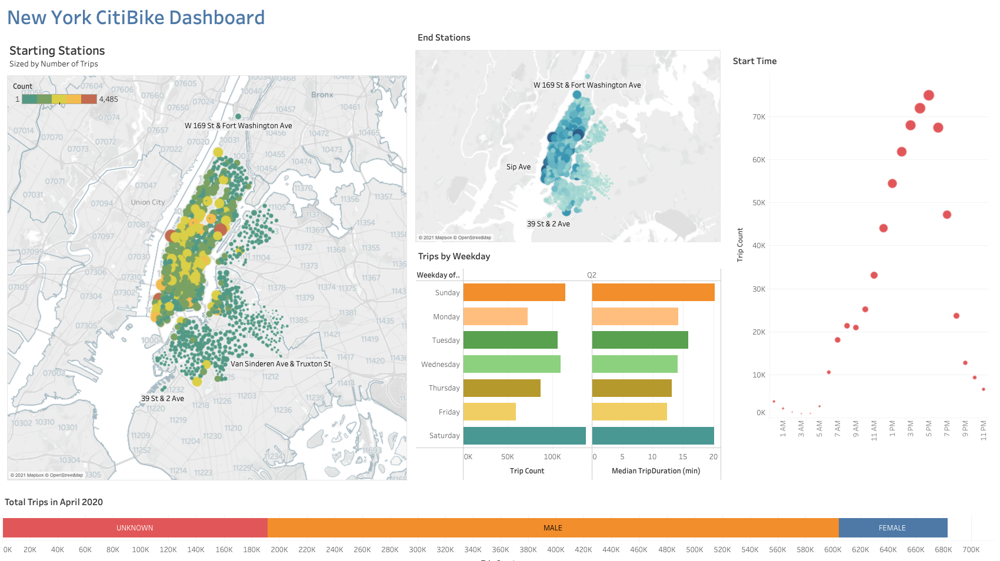
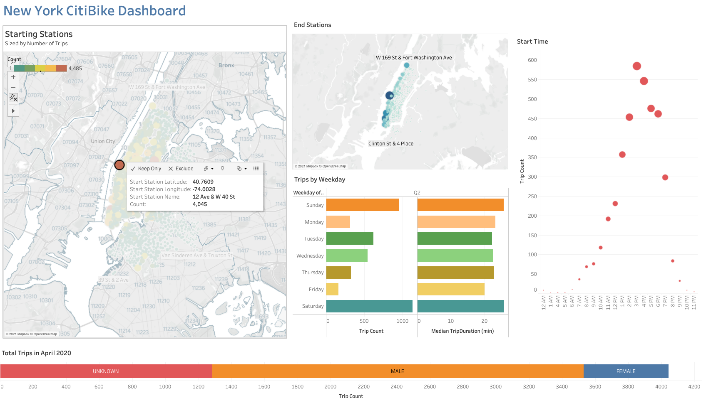
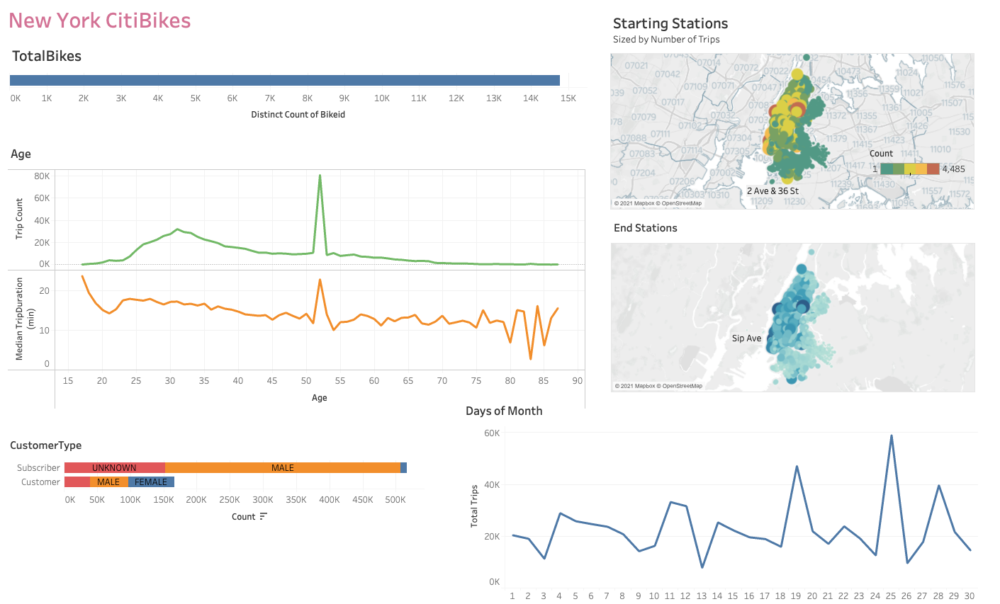
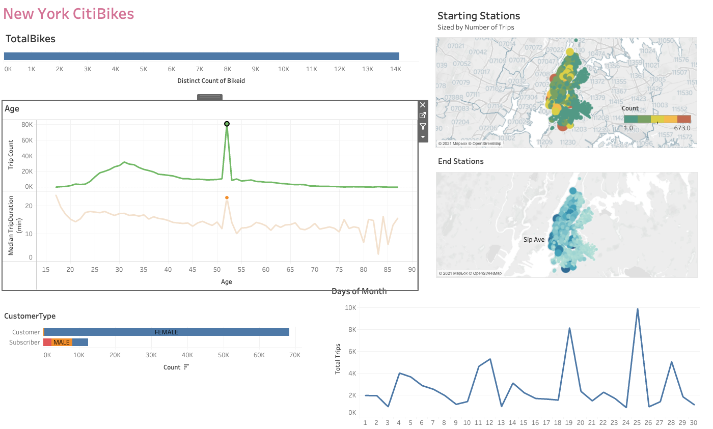
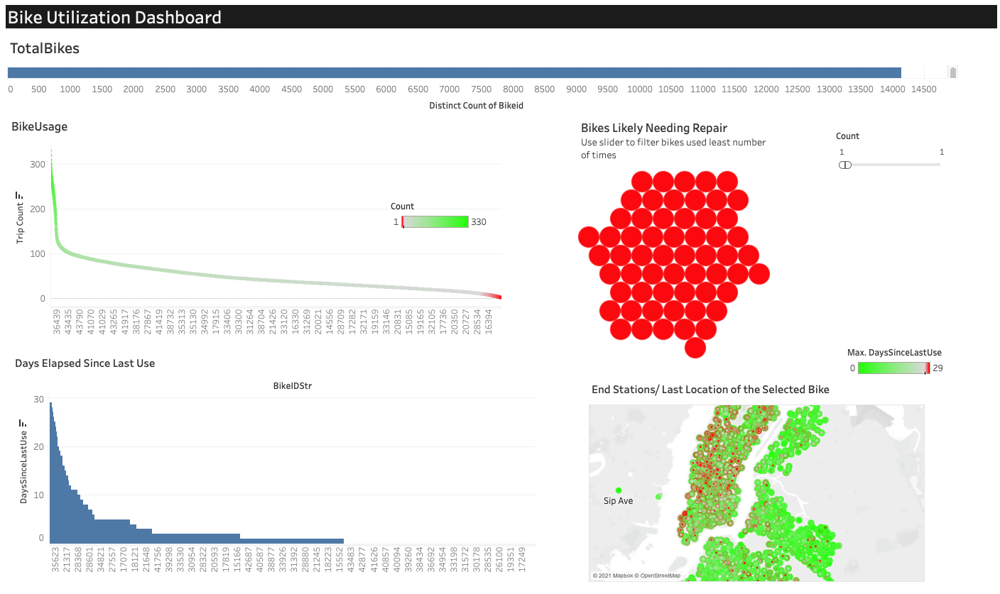
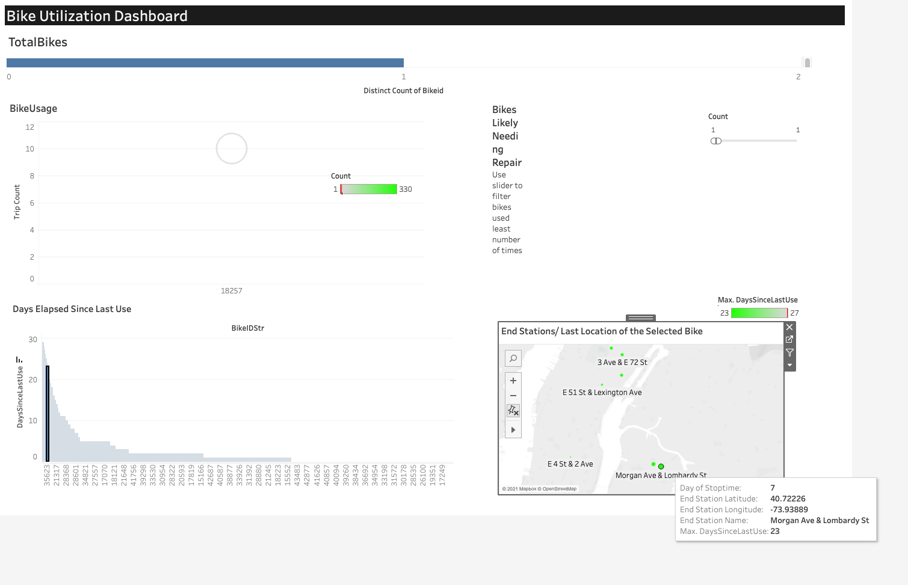
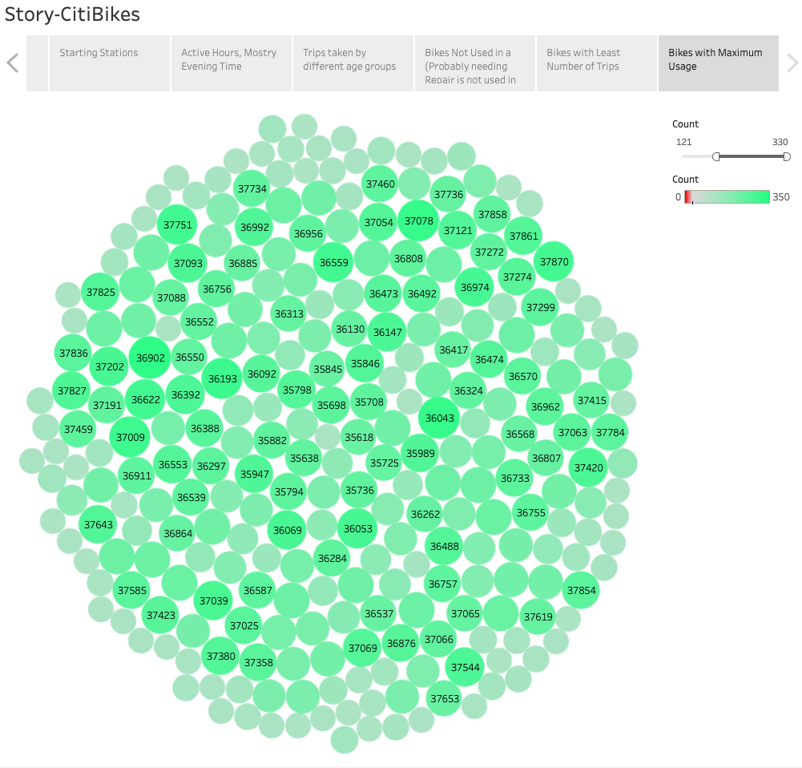

# Tableau - New York CitiBike Data Analysis

Data for April 2020 was downloaded from the the following website:

https://www.citibikenyc.com/system-data

Over __14000+__ unique bike id's were identified in the data set:

Total number of trips made during the month were calculated by creating a count column in Tableau. __600K+__ trips were made during the month in New York City. A majority of those trips were made by males as shown in the image below.

__Three dashboards__ were created to visualize the statistics of the trips taken. The firsts dashboard (<b>DashBoard_TripCounts</b>) is shown below. Dashboard <b>Actions</b> were activated for dynamic views on Select option. Analyzing the trip counts by day of the week shows that most of the rentals happen on weekends and also the start time of the rental is usually in the evening time period indicating that the bikes are not being used for office commute. 

The size of the circles on the map are scaled by the total number of trips. The map shows that there are few locations where most rentals are taken. On selecting the starting station with most trip counts (**12 Ave & W 40 St**) the following were observed:

- Most bikes are returned to the location they are rented from as seen in the **End Stations** map. 
- It appears people rode the bikes along the coastline and returned at different locations on the coastline (see **End Stations** map)
- Most rentals are on the weekends, in the evening with short trip durations indicating pleasure rides or for exercise.

### DashBoard Age_Gender

The second dashboard was created to see age and gender statistics of the trips. A snapshot of the dashboard is shown below. As seen from the dashboard as large number of customers have annual subscription (__Subscriber__) and majority of that is comprised of males. 

The age group distribution is mostly concentrated in the 25 to 45 age group based on the trip count, however, a spike was seen in the age group of 52. To see if the data was valid, that age group was selected and the spread of data in the start and end stations was observed (see image below). *Surprisingly, the data is spread over all the stations and majority of the trips in that age group were taken __female customers__*.

### Dashboard Bike Usage

The third dashboard, __DashBoard_BikeUsage__ shows the usage statistics of bikes. The dashboard shows that a few bikes are used for over 300 trips during the month where as a large majority of the bikes were used than less than 100 times. 

There are also a few bikes that were not used much during the month. To identify the number of days that a bike was not used 2 calculated fields were created.

1. `[Last Used Date] = {FIXED [Bikeid]:MAX([Stoptime])}`
2. `[DaysSinceLastUse] = 30 - DAY([LastUsedDate])`

The days since last use was used as a guide to identify the bikes that were not actively used. The higher the number the more likely the bike has a repair issue. Also a bubble chart was included to identify bikes that used only once during the month. A map showing the station locations with bikes that have not been used in the last 27-29 days is included in the dashboard for identifying stations where bike repairs are needed. On selecting one of the bikes that has not been used for 23 days, the map shows the end stations for the bike where the circle are scaled by the [Day of Stoptime] to find the __last location of the bike__.

### Story-CitiBikes

A story is created from __16 visualizations__ created in this analysis.

